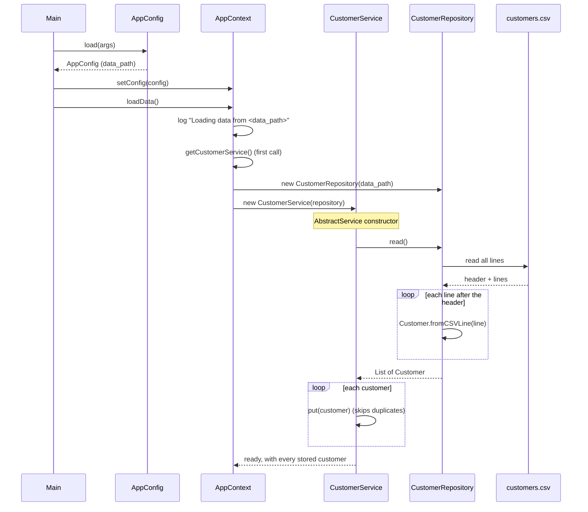
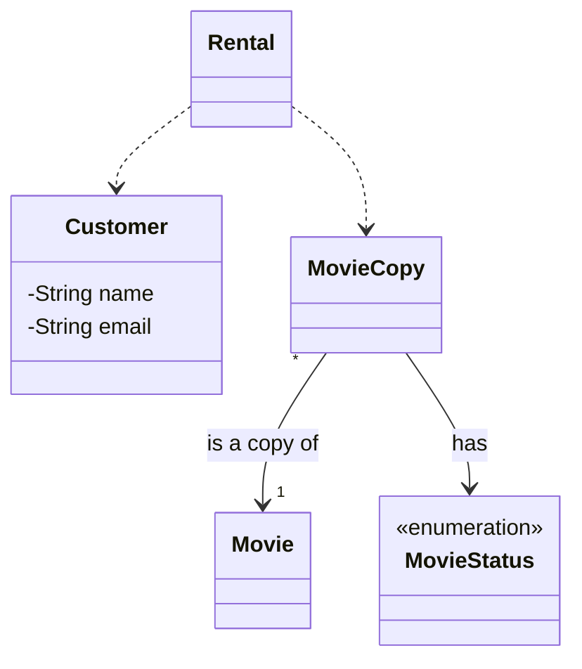
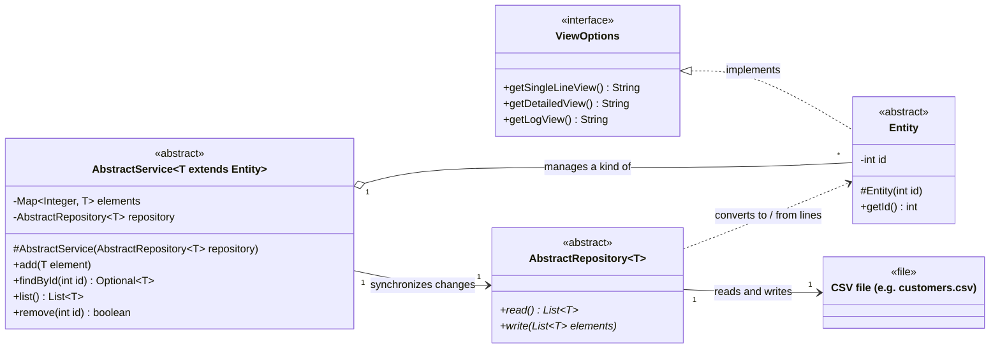
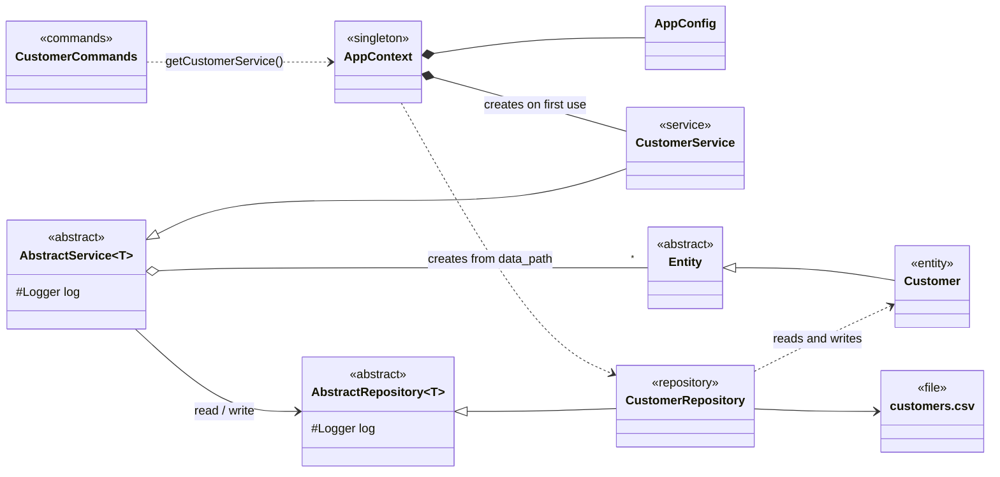
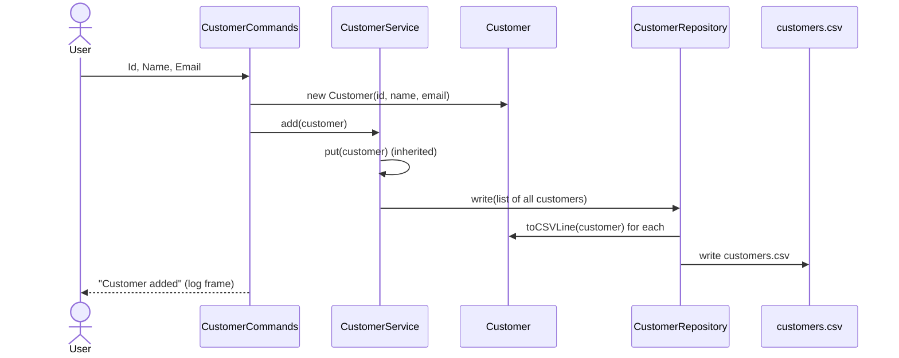

# Architecture guide

How the code is organised, and what happens when the app starts. The diagrams are
[Mermaid](https://mermaid.js.org/), so GitHub and VS Code (with a Mermaid extension) draw them.

- [1. Entity, Service, Repository](#1-entity-service-repository)
- [2. What happens at boot](#2-what-happens-at-boot)
- [3. UML: the entities](#3-uml-the-entities)
- [4. UML: the base classes and the CSV file](#4-uml-the-base-classes-and-the-csv-file)
- [5. UML: Entity → Service → Repository (Customer)](#5-uml-entity--service--repository-customer)
- [6. Adding a new entity](#6-adding-a-new-entity)

## 1. Entity, Service, Repository

The data of the app is split in three layers. Each one has one job and only talks to the layer
next to it.

| Layer | Job | Knows about | Does **not** know about |
|---|---|---|---|
| **Entity** | One thing of the real world (a customer, a movie), and what makes it valid | its own fields and rules | collections, files, other entities' storage |
| **Service** | The *collection* of an entity and the rules about the collection (unique ids, add, find, remove) | the entity, the repository (as a black box) | file paths, CSV, how data is stored |
| **Repository** | Storing and reading entities, i.e. the only place that knows *how* they are stored | the entity, the file format | business rules, menus, the UI |

```text
 menus / commands  ──►  Service  ──►  Repository  ──►  customers.csv
                          │               │
                          └──── Entity ◄──┘
```

Each layer has a generic base class in the [entity](../src/main/java/entity) package, and each
entity only adds what is specific to it:

| Layer | Base class (package `entity`) | Customer's class (package `customer`) |
|---|---|---|
| Entity | `Entity` (id and its validation, `ViewOptions`) | `Customer` |
| Service | `AbstractService<T extends Entity>` | `CustomerService` |
| Repository | `AbstractRepository<T>` | `CustomerRepository` |

**Entity.** Identified by its id (kept and validated, a positive integer, by the base class `Entity`) and
never allowed to exist in an invalid state: the constructor and the setters throw `IllegalArgumentException` for bad values, so a `Customer` you are holding
is always valid. The base class also requires three views of the entity (`getSingleLineView`, `getDetailedView`,
`getLogView`, from `ViewOptions`). It also knows how to turn itself into a CSV line and back
(`Customer.toCSVLine` / `Customer.fromCSVLine`), because only the class knows its own columns.

**Service.** `AbstractService` owns the in-memory collection (a `Map` by id) and the rules about
it, such as "two elements cannot share an id". It provides `add`, `findById`, `list` and
`remove`, and it loads in its constructor. Commands and menus only talk to the service. After
every change (`add`, `remove`) the service hands the whole list to the repository, so callers
never have to remember to save. `CustomerService` has almost no code of its own: it only fixes
the type to `Customer`, and is where rules that only customers have would go.

**Repository.** `AbstractRepository` is only the contract: `read()` returns every stored element
and `write(list)` stores them all. `CustomerRepository` implements it by reading and writing the
CSV file: the folder, the file name, the header, skipping
bad lines, and writing through a temporary file so a failure never leaves the file half written.
If we moved to a database tomorrow, only this class would change.

**Logging.** The base classes have a `protected final Logger log` created with
`Logger.getLogger(getClass().getName())`. `getClass()` is the real class of the object, so even
a message written in `AbstractService` is logged as `customer.CustomerService`. Subclasses use
the inherited `log` and must not declare their own.

Why bother? Each class has one reason to change, you can read one layer without understanding the
others, and a bug has an obvious place to live: *wrong data* → entity, *wrong rules* → service,
*wrong file* → repository.

Status today: **Customer** is the only entity on this architecture, with all three layers.
**Movie**, **MovieCopy** and **Rental** have not been moved to it yet: they do not extend
`Entity` and have no service or repository. They will be migrated when they are ready (see
[section 6](#6-adding-a-new-entity)).

## 2. What happens at boot

Everything before the first screen appears, in order. It starts in [Main](../src/main/java/Main.java):

```java
LogBuffer.install();                                       // 1
log.info("Welcome to Blockbuster!");                       // 2
AppContext.getInstance().setConfig(AppConfig.load(args));  // 3
AppContext.getInstance().loadData();                       // 4
Screen.start();                                            // 5 (UI, not covered here)
new MenuOptions().runMenu();                               // 6 (UI, not covered here)
```

1. **Logging** is redirected into an in-memory buffer (`LogBuffer`), so everything logged from
   here on can be shown in the log frame instead of the console.
2. A **welcome** line is logged.
3. **Configuration** is read by `AppConfig.load(args)` and given to the `AppContext`.
   - The file is the first program argument, or `config.properties` in the current folder.
   - A missing file, an empty file, or a missing or blank property is fine: the default is used.
   - What is read is logged, so you can see which file and values were used.
4. **Data** is loaded by `AppContext.loadData()` (details below).

| Property | Default | Meaning |
|---|---|---|
| `data_path` | `data` | Folder holding the CSV files. Loading and saving both use it, so they always agree. |

### The Singleton pattern

A **singleton** is a class that has exactly **one instance** in the whole program, and gives
everyone the same one. You can't create it with `new`; you ask the class for it.

```java
public class AppContext {
    private static final AppContext INSTANCE = new AppContext();   // the one and only instance

    private AppContext() { }                                        // private: nobody else can call `new`

    public static AppContext getInstance() {                        // everyone gets the same object
        return INSTANCE;
    }
}
```

Three ingredients: a **private constructor**, a **static field** holding the single instance, and
a **static method** that returns it.

Why use it here: the customers must exist **once**. If the menus and the code that loads the
data each created their own `CustomerService`, they would hold different lists and a customer
added in one place would not exist in the other. With a singleton, `AppContext.getInstance()`
returns the same object everywhere.

Its cost: it is global state, which any class can reach. Code that quietly depends on a global is
harder to test (you can't easily swap in a fake) and its dependencies are hidden. That is why
only the app's shared things live in it, and why the layers below it (`CustomerService`,
`CustomerRepository`) are plain classes that receive what they need through their constructor,
not singletons.

### The AppContext

[AppContext](../src/main/java/app/AppContext.java) is a *singleton*: one instance for the whole
program, reached with `AppContext.getInstance()`. It is the one place where the shared things
live, so every part of the app talks to the **same** `CustomerService` and reads the **same**
configuration. It holds:

- the `AppConfig` (starts with the defaults until `setConfig` replaces it), and
- the `CustomerService`.

The service is **not** built when `AppContext` is created. It is built on the first
`getCustomerService()` call, because it needs the final config (where the data folder is) and
building it also loads the customers. That is why `Main` sets the config *before* loading data.
Calling `setConfig` again discards the service; the next `getCustomerService()` builds a new one
from the new location.

### Loading the customers



Two rules make this safe:

- The service **loads in its constructor**, so a `CustomerService` that exists is always loaded.
  Otherwise the first `add` after a forgotten `load()` would save a file with only the new
  customer and overwrite the stored ones.
- Loading never saves back. Only `add` and `remove` do.

A bad line (wrong number of columns, an id that is not a number, a name that is blank, …) never
stops the app: it is logged as a warning and skipped. A missing file is logged as an error and
the app starts with no customers.

## 3. UML: the entities



Notes:

- **Customer** is the finished entity. Its id never changes, `equals`/`hashCode` use only the id
  (two customers are the same customer if they share an id), and the setters validate. Names and
  emails cannot contain a comma, because that would corrupt the CSV.
- **Movie**, **MovieCopy** and **Rental** are still the old, standalone classes: they do not
  extend `Entity` yet and have no service or repository. A `Movie` is the film; each
  physical/rentable item is a `MovieCopy` that points to its `Movie` and has a `MovieStatus`.

## 4. UML: the base classes and the CSV file

The generic part of the architecture, with no entity in particular: the three base classes in
the [entity](../src/main/java/entity) package and the CSV file where the data ends up.



Notes:

- `AbstractService` is the only class the rest of the app talks to. It keeps the entities in
  memory and, after every `add` or `remove`, hands the whole list to the repository.
- `AbstractRepository` is only a contract (`read` and `write`). The concrete subclass, e.g.
  `CustomerRepository`, is the one that knows the CSV file: its path, header and columns.
- The service never sees the file, and the file format never leaks above the repository.

## 5. UML: Entity → Service → Repository (Customer)



Reading it left to right: the commands ask the `AppContext` for the service; the service keeps
the customers and the rules (inherited from `AbstractService`); it only knows the repository
through `AbstractRepository`, and `CustomerRepository` turns the customers into lines of
`customers.csv` and back, using the `Customer` methods that know the columns.

What happens when the user adds a customer:



Each layer rejects what it is responsible for: the **entity** rejects invalid values, the
**service** rejects duplicates, and the **repository** is the only one that can fail on the disk
(that is logged as an error and the change stays in memory).

## 6. Adding a new entity

For example, Movie, once it is ready. The base classes do most of the work:

1. **Entity**: make it `extends Entity` (so it gets the id and `ViewOptions`), validated, with
   `fromCSVLine`, `toCSVLine` and a `CSV_HEADER`.
2. **Repository**: `MovieRepository extends AbstractRepository<Movie>`, with a
   `MovieRepository(String dataPath)` constructor and the `read()` and `write(List<Movie>)`
   methods. Use the inherited `log`.
3. **Service**: `MovieService extends AbstractService<Movie>` whose constructor only calls
   `super(repository)`. Add only the rules that are specific to movies.
4. **AppContext**: a `getMovieService()` built on first use, like the customer one, and one more
   line in `loadData()` so it loads at boot.
5. **Commands**: menus call the service through `AppContext`; they never touch the repository.
